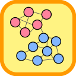

# Comuna.NET
> A community analysis, tracking and graphing library for social networks written in C#

Comuna is a .NET open-source library written entirely in C# that implements the *Louvain method* for finding communities in large networks as described in [Blondel *et. al*, 2008]. The code corresponds to a C# adaptation of the C++ code in https://sites.google.com/site/findcommunities/. The main concept is that of *network modularity* that assesses the quality of the current community partition. The algorithm works by successively improving the network's modularity by trying to change the community that each node belongs to. If there is no improvement in modularity this means that the best community partition has been found.

Comuna.NET supports multiple updates to the underlying network connections (graph links), *i.e.*, it allows the analysis of the *evolution of communities* in a network.  In addition, the results of community analysis can be exported to multiple formats. Specifically, Comuna.NET exports to image formats for the visualization of network structure and communities via [Graphviz](https://www.graphviz.org/), and to json files that can be imported into [Communities Viewer](https://github.com/pedrodbs/CommunitiesViewer), an interactive web-application using [D3.js](https://d3js.org/).

**Table of contents**

- [About](#about)
- [API Documentation](#api-documentation)
- [Packages and Dependencies](#packages-and-dependencies)
- [Installation](#installation)
- [Features](#features)
- [Examples](#examples)
- [See Also](#see-also)

------

## About

Comuna.NET is open-source under the [MIT license](https://github.com/pedrodbs/Comuna/blob/master/LICENSE.md) and is free for commercial use.

- Source repository: https://github.com/pedrodbs/Comuna
- Issue tracker: https://github.com/pedrodbs/Comuna/issues

Supported platforms:

- All runtimes supporting *.NET Standard 1.3+* (*.NET Core 1.0+*, *.NET Framework 4.6+*) on Windows, Linux and Mac

## API Documentation

- [HTML](https://pedrodbs.github.io/Comuna/)
- [Windows Help file (CHM)](https://github.com/pedrodbs/Comuna/raw/master/docs/Comuna.NET.chm)
- [PDF document](https://github.com/pedrodbs/Comuna/raw/master/docs/Comuna.NET.pdf)

## Packages and Dependencies

The following packages with the corresponding dependencies are provided:

- **Comuna:** core package with the communities analyzer. 
  - [QuickGraph](https://github.com/pedrodbs/quickgraph) (forked to allow colored edges and vertexes when exporting to Graphviz dot format)
- **Comuna.D3:** package that includes the communities tracker algorithm and the methods to export them to Json files to be visualized with D3.js. 
  - [Json.NET](https://www.nuget.org/packages/Newtonsoft.Json/) v11.0.2
- **Comuna.Graphviz:** package to create undirected graph representations for the networks and communities and export them to image files via [Graphviz](https://www.graphviz.org/).
  - [QuickGraph](https://github.com/pedrodbs/quickgraph) (forked to allow colored edges and vertexes when exporting to Graphviz dot format)

## Installation

You can `git clone` the Comuna.NET [source code](https://github.com/pedrodbs/Comuna) and use an IDE like VisualStudio to build the corresponding binaries.

## Getting started

Consider the following *network* example from [Blondel *et. al*, 2008] represented as an undirected graph:


where each node can represent a different person and links can denote a connection or relationship between two individuals. In this example all connections have a weight of $1$, but arbitrary weights can be provided denoting *e.g.*, different degrees of relationship.

We start by creating a `Network` object and adding all *nodes*. In Comuna.NET each node is represented by a different `uint` identifier:

```c#
var network = new Network();
for (var i = 0u; i < 16; i++)
    network.AddVertex(i);
```
We then define each `Connection` in the network by adding *edges* between the nodes:

```c#
network.AddEdge(new Connection(0, 2));
network.AddEdge(new Connection(0, 4));
network.AddEdge(new Connection(0, 3));
network.AddEdge(new Connection(0, 5));
network.AddEdge(new Connection(1, 2));
network.AddEdge(new Connection(1, 4));
network.AddEdge(new Connection(1, 7));
...
```
After having defined the network we can create the algorithm to analyze the communities:

```c#
var communityAlg = new CommunityAlgorithm(network, -1, 0);
```

where we define the *number of passes* of the algorithm (if $-1$, the algorithm computes as many passes as needed to increase the network's modularity) and the *minimum modularity gain*, corresponding to the criterion used to perform a new pass (if $0$, even a minor increase is enough to perform one more pass).

We then update the algorithm to discover the communities in the network, *i.e.*, the best community partition:

```c#
communityAlg.Update();
```

A call to `DisplayCommunities` will then result in the following output:

```
Community: 0, Nodes: [8;9;10;12;14;15], In: 0, Tot: 20
Community: 1, Nodes: [1;4;2;0;5], In: 14, Tot: 20
Community: 2, Nodes: [11;13], In: -4, Tot: 7
Community: 3, Nodes: [3;7;6], In: 4, Tot: 9
```

By calling the `Update` function without arguments the nodes' communities are automatically renumbered, meaning that their identifying numbers (`uint`) are the lowest possible. If we don't want to renumber the communities we would call:

```c#
communityAlg.Update(false);
```

which would result in the following communities being formed:

```
Community: 1, Nodes: [1;4;2;0;5], In: 14, Tot: 20
Community: 3, Nodes: [3;7;6], In: 4, Tot: 9
Community: 9, Nodes: [9;14;12;8;15;10], In: 16, Tot: 20
Community: 11, Nodes: [11;13], In: 2, Tot: 7
```

## Features

- **CSV import and export**

  - Allows the creation of a new `Network` by reading the edge information stored in a given CSV (comma-separated values) file. The format is simply 'source_node, target_node [, weight]'. If not provided, weight of the edge is considered to be $1$. For example, the following code would load the network stored in `C:\network.csv` :

    ```c#
    network = Network.LoadFromCsv("C:\\network.csv");
    ```

  - Similarly, a network can be exported to a CSV file by calling:

    ```c#
    network.SaveToCsv("C:\\network=export.csv");
    ```

- **Communities tracking & D3.js export**

  - Let's now image that the network's connections are *changing throughout time* as a consequence of an external process, *e.g.*, that the relationships between the individuals in the network are developing, that new relationships are being formed or that existing relationships are ending. 

  - In Comuna.NET, this corresponds to either adding or removing edges from the network, *e.g.*:

    ```c#
    network.AddEdge(new Connection(0, 1));		// adding a new connection
    network.RemoveEdge(new Connection(0, 2));	// removing an existing connection
    ```

    **Note:** to change the weight associated with a connection, we first remove the connection from the network and then add a new one with the new weight, *e.g.*:

    ```c#
    network.RemoveEdge(new Connection(0, 2));	// removing an existing connection
    network.AddEdge(new Connection(0, 2, 0.5));	// changing the weight
    ```

  - By using the *Comuna.D3* package we can track the changes in the network's connections and the consequent changes in the nodes' communities at each time step and later visualize them using the [Communities Viewer](https://github.com/pedrodbs/CommunitiesViewer) web-application. To create the tracker we simply call:

    ```c#
    using Comuna.D3
    ...
    var tracker = new CommunityTracker(communityAlg, pathToD3File, maxUpdates)
    ```

    where `pathToD3File` is the path to the *Json* file where the network, its connections and the nodes' communities are written after the update at each time step. `maxUpdates` is the *maximum number of updates* that are going to be performed to the network's connections.
    **Note:** the tracker initially creates the Json file and at each update it appends the information regarding changes in the network structure (addition and removal of nodes) and in the nodes' communities.

  - At each time step, after updating the network's connections we also update the community algorithm and the tracker, *e.g.*: 

    ```c#
    for(var i=0; i<100; i++)
    {
        // update connections to network
        ...
        communityAlg.Update();
        tracker.Update();
    }
    tracker.Dispose()
    ```

    where we can call `tracker.Dispose()` to release the lock to the Json file being updated.

  - When loaded in [Communities Viewer](https://github.com/pedrodbs/CommunitiesViewer), the first time step would produce the following community graph:

- **Graphviz export**

  - Export a program's tree representation to image file with [Graphviz](https://www.graphviz.org/) (requires Graphviz installed and *dot* binary accessible from the system's path), *e.g.*:

    ```c#
    using Comuna.Graphviz;
    using QuickGraph.Graphviz.Dot;
    ...
    var filePath = communityAlg.ToGraphvizFile(
    	Path.GetFullPath("."), "communities-graphviz.png", true, GraphvizImageType.Png);
    ```

    would produce the following image:

    

## Examples

Example code can be found in the [src/Examples](https://github.com/pedrodbs/Comuna/tree/master/src/Examples) folder in the [repository](https://github.com/pedrodbs/Comuna). Several open-source social networks adapted to work with the example applications can be found in [src/Examples/networks](https://github.com/pedrodbs/Comuna/tree/master/src/Examples/networks).

- **CommunitiesEvolution:** a simple example of the evolution of a social network involving tracking the addition and removal of connections. The results are saved to a Json file for later visualization.

- **CommunitiesGenerator:** a Windows.Forms application to generate random network connections between a given number of nodes and also a random number of update time-steps. The final network structure and nodes' communities is displayed and the corresponding Json file is saved.

- **CommunitiesVisualizer:** a Windows.Forms application that allows loading a network from a CSV file for the visualization of the communities therein. The community algorithm can be parameterized and the result can be exported to an image file.


## See Also

**References**

1. Blondel, V. D., Guillaume, J. L., Lambiotte, R., & Lefebvre, E. (2008). [Fast unfolding of communities in large networks](http://iopscience.iop.org/article/10.1088/1742-5468/2008/10/P10008). *Journal of statistical mechanics: theory and experiment*, *2008*(10), Bristol: IOP Publishing Ltd.

**Other links**

- [Louvain method: Finding communities in large networks](https://sites.google.com/site/findcommunities/)
- [Communities Viewer](https://github.com/pedrodbs/CommunitiesViewer)
- [D3.js](https://d3js.org/)


Copyright &copy; 2018, [Pedro Sequeira](https://github.com/pedrodbs)